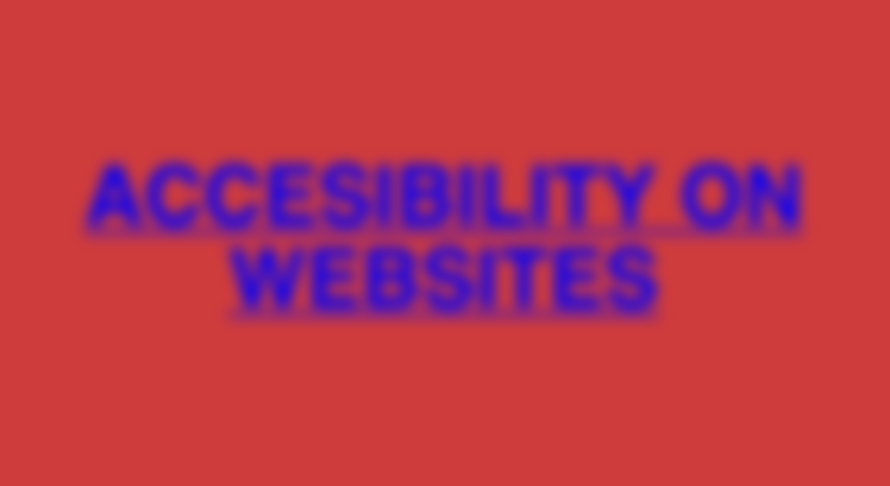
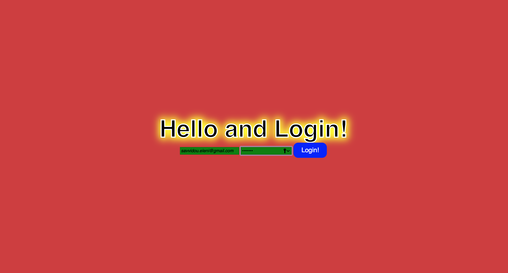
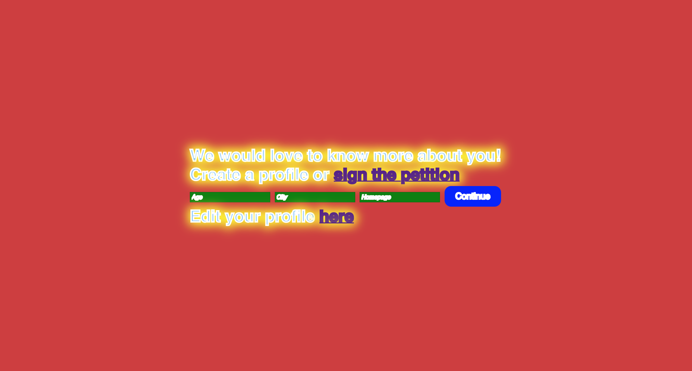
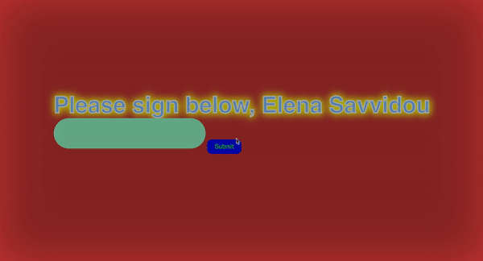
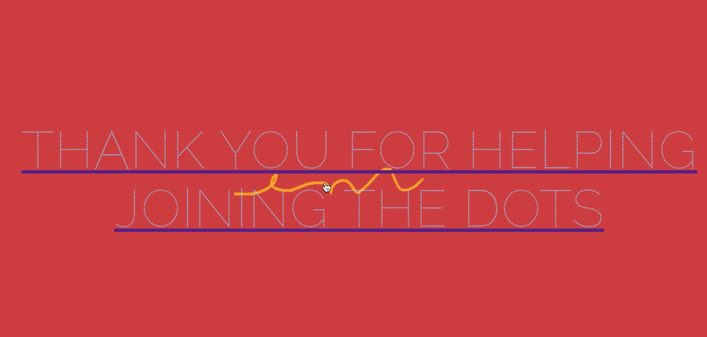
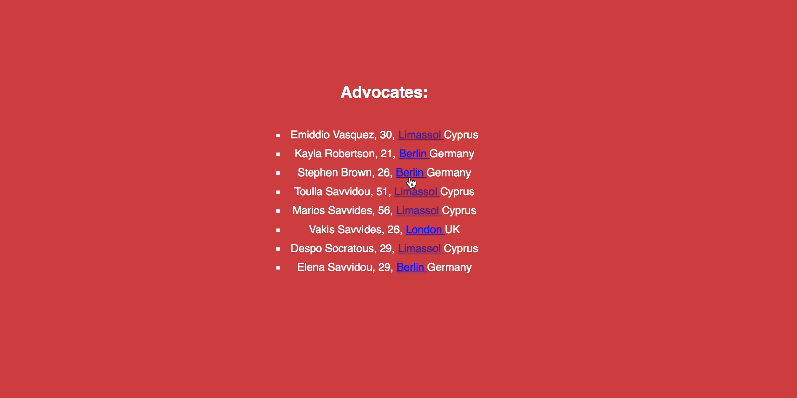

# Accessibility on Websites

> During this project I researched Accessibility on Websites.
>
> Using **Express Handlebars, Node.js, Canvas, jQuery and CSS**, I built and designed a petition that was blurry, uncomfortable and user un-friendly.
>
> The idea was for users to experience the difficulty of registration/log-in, navigation through a site and sign the petition, in an environment that was not weaved to their needs.

-----

> Page blurs while user types their info in input fields

> Existing users can login, add more information, edit their profile and logout.
>
> The boldness and brightness of the text was made on purpose to serve the petition's theme.

> User can sign and submit their signature, while page's brightness changes.

> User's signature is being saved and displayed as a link that leads to other people that have signed this petition.

> A list of signees with their info is shown. When you click on the city, you get a list of signees who leave there.

